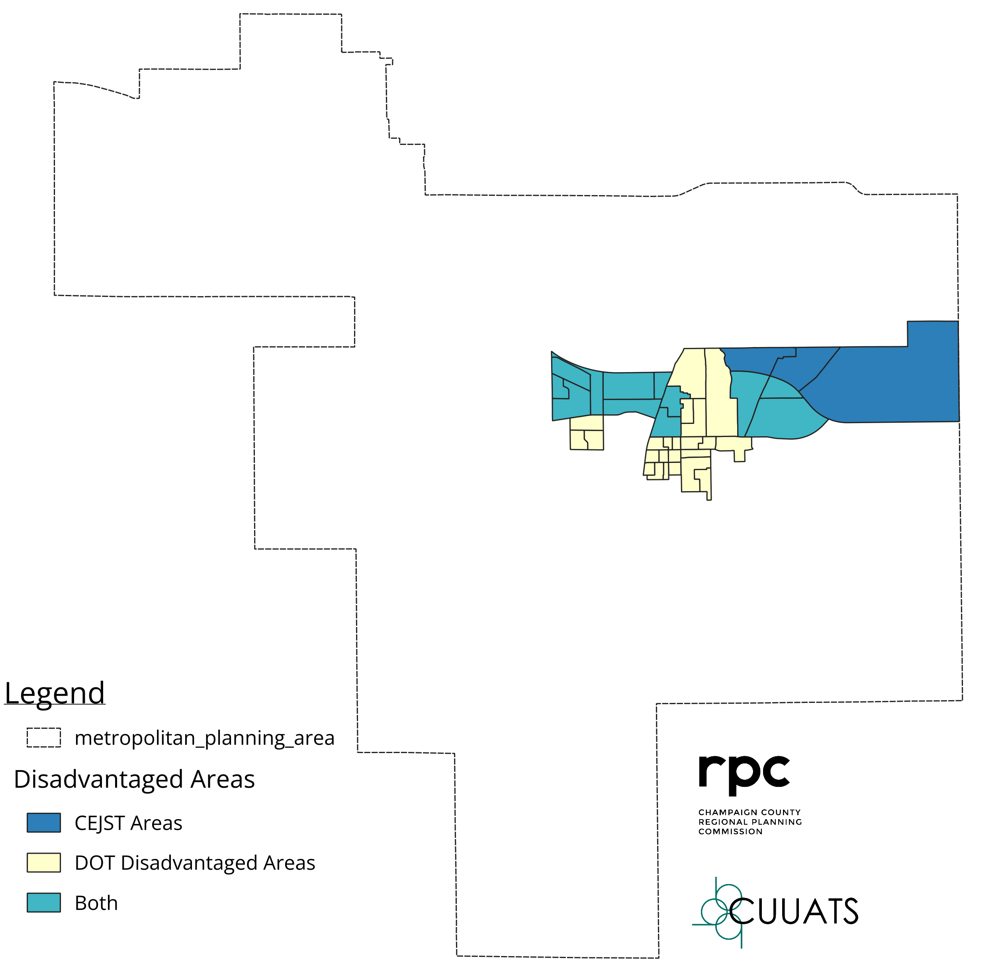

# Regional Demographics in Comparison to State and Federal Statistics

The metropolitan planning area population decreased by 0.5 percent, from 168,334 to 167,536, according to 2018 and 2022 ACS block group data estimates. This decrease is due in part to the US Census Bureau removing the Village of Tolono from the Champaign-Urbana urban area boundary and because of population changes that occurred during the peak of the COVID-19 pandemic.
 
Using US Census Bureau data, Figures 1-6 below show the composition of the MPA population alongside the composition of the state and the nation for the different demographics covered under the Title VI legislation: race, ethnicity, English proficiency, poverty, persons with disabilities, and age. The presence of tens of thousands of students attending the University of Illinois flagship campus contributes to many of the significant differences between the demographics of the MPA and those of the state and the nation. 

Those of Hispanic or Latine heritage comprise only 6.7 percent of the MPA population, which is proportionately less than half when compared roughly 18 percent in the state and nearly 19 percent in the nation overall. Both the Limited English Proficiency (LEP) and the disabled populations make up less than the percentages at the state and federal level as well. The lower LEP population from the 2019 Title VI document may be due in part to the 2020 Census counts that were hindered by a lack of student population during the peak of the COVID-19 pandemic, which halted in-person classes on the University of Illinois' campus in the Fall of 2020.

The percentage of individuals living at or below the poverty line is significantly higher in the MPA than in the state or nation: over 25 percent in the MPA compared with 17-18 percent at the state and federal levels. However, the proportion of those individuals living in family households is smaller (6.6 percent MPA, 7.9 percent state, and 8.5 percent federal), while the proportion of those individuals in non-family households and other living arrangements is significantly higher than in the state or nation (19.3 percent MPA, 9.0 percent state, and 9.3 percent federal). The high proportion of individuals living at or below the poverty line living in non-family households and other living arrangements can, at least partially, be attributed to the student population that is largely relying on student loans and other outside funding sources while studying at the university. Within the MPA, 15-24-year-olds make up approximately 26 percent of the entire population, twice as high as the rate for populations at the state or federal levels. The Asian population percentage is also much higher than the state or national average at over twice the rate of residency.

<rpc-chart
url="UA_Age.csv"
type="horizontalBar"
colors="lightblue, #3399CC,indigo,#000066, gray"
y-label="Percent"
x-max="100"
stacked="true"
legend-position="top"
legend="true"
tooltip-intersect="true"
width="80%"
aspect-ratio="3"
source="U.S. Census Bureau, 2018-2022 ACS 5-year estimates, Table B01001, Accessed 22 December 2023"
source-url="https://data.census.gov/table/ACSDT5Y2022.B01001?q=B01001&g=010XX00US_040XX00US17_400XX00US15211,53416"
chart-title="Figure 1. Percent Population by Age, 2022 5-year estimates"></rpc-chart>

<rpc-chart
url="UA_Poverty.csv"
type="horizontalBar"
colors="lightblue, #3399CC"
x-label="Percent"
x-max="40"
x-min="0"
stacked="true"
legend-position="top"
legend="true"
tooltip-intersect="true"
width="80%"
aspect-ratio="3"
source="U.S. Census Bureau, 2018-2022 ACS 5-year estimates, Table B17021, Accessed 22 December 2023"
source-url="https://data.census.gov/table/ACSDT5Y2022.B17021?q=B17021&g=010XX00US_040XX00US17_400XX00US15211,53416"
chart-title="Figure 2. Percent Population Poverty Status by Household Type, 2022 5-year estimates"></rpc-chart>

<rpc-chart
url="UA_Race.csv"
type="horizontalBar"
switch="true"
colors="lightblue, #3399CC,#6666CC,indigo,#000066, lightgray, gray"
x-label="Percent"
x-max="100"
stacked="true"
legend-position="top"
legend="true"
tooltip-intersect="true"
width="80%"
aspect-ratio="2"
source="U.S. Census Bureau, 2018-2022 ACS 5-year estimates, Table B02001, Accessed 22 December 2023"
source-url="https://data.census.gov/table/ACSDT5Y2022.B02001?q=B02001&g=010XX00US_040XX00US17_400XX00US15211,53416"
chart-title="Figure 3. Percent Population by Race, 2022 5-year estimates"></rpc-chart>

<rpc-chart
url="UA_Hispanic.csv"
type="horizontalBar"
colors="indigo"
x-label="Percent"
x-max="20"
x-min="0"
columns="-3"
legend-position="top"
legend="true"
tooltip-intersect="true"
width="80%"
aspect-ratio="3"
source="U.S. Census Bureau, 2018-2022 ACS 5-year estimates, Table B03003, Accessed 22 December 2023"
source-url="https://data.census.gov/table/ACSDT5Y2022.B03003?q=B03003&g=010XX00US_040XX00US17_400XX00US15211,53416"
chart-title="Figure 4. Percent Population Hispanic/Latine Heritage, 2022 5-year estimates"></rpc-chart>

<rpc-chart
url="UA_LEP.csv"
type="horizontalBar"
colors="#3399CC"
x-label="Percent"
x-max="20"
x-min="0"
columns="-3"
legend-position="top"
legend="true"
tooltip-intersect="true"
width="80%"
aspect-ratio="3"
source="U.S. Census Bureau, 2018-2022 ACS 5-year estimates, Table B16004, Accessed 22 December 2023"
source-url="https://data.census.gov/table/ACSDT5Y2022.B16004?q=B16004&g=010XX00US_040XX00US17_400XX00US15211,53416"
chart-title="Figure 5. Percent Population with Limited English Proficiency, 2022 5-year estimates"></rpc-chart>

<rpc-chart
url="UA_Disabled.csv"
type="horizontalBar"
colors="lightblue"
x-label="Percent"
x-max="20"
x-min="0"
columns="-3"
legend-position="top"
legend="true"
tooltip-intersect="true"
width="80%"
aspect-ratio="3"
source="U.S. Census Bureau, 2018-2022 ACS 5-year estimates, Table B18101, Accessed 22 December 2023"
source-url="https://data.census.gov/table/ACSDT5Y2022.B18101?q=B18101&g=010XX00US_040XX00US17_400XX00US15211,53416"
chart-title="Figure 6. Percent Population with a Disability, 2022 5-year estimates"></rpc-chart>

### Regional Commuting Behavior Profile

Figures 7 and 8 show that commuters in the MPA chose to walk and bike more than three times as much as the state and national rates. More commuters in the MPA use public transportation than in the nation but less than in the state. Locating additional funding for active modes of transportation infrastructure has not been easy in the MPA, or many other parts of the country. The MPA still has made some progress since the last Title VI document was approved to initiate new or improved infrastructure for active modes. The infrastructure for active modes of transportation is still not as widespread as the local street network, and its coverage will be assessed with respect to each of the Title VI demographic groups in this report.

MPA and Illinois residents use public transit at nearly double the rate of the nation. The Champaign-Urbana Mass Transit District (MTD) provided nearly 8.5 million trips in fiscal year 2023. It should be noted that the Champaign-Urbana Mass Transit service area is not contiguous with and does not extend beyond the Champaign-Urbana urbanized area boundary and therefore excludes the Villages of Bondville, Mahomet, and Tolono. The Champaign County Area Rural Transit System (C-CARTS) does cover the entire MPA region, and the service provided nearly 24,000 trips throughout the county in 2022. The higher percentage of public transit users in Illinois compared to the nation can partially be attributed to the large Chicago population.

Figure 9 also shows that despite higher percentages of commuting by active modes of transportation in the Champaign-Urbana MPA, commute times are significantly lower than the state and the nation, with a mean of a 15.5 minute commute in the MPA compared with 28.4 minutes and 26.7 minutes in the state and nation, respectively. Since 2017, the commute time went down for Champaign-Urbana's urban areas. This can be partially attributed to the Village of Tolono being removed as part of the urban area boundary, where average commute times would likely be longer. Commute time data are not available for individual demographic groups.

<rpc-chart
url="UA_Commute_Type.csv"
type="Bar"
stacked="true"
colors="lightblue, #3399CC,#6666CC,indigo,#000066, lightgray, gray"
y-label="Percent"
y-max="100"
y-min="0"
legend-position="top"
legend="true"
tooltip-intersect="true"
width="60%"
aspect-ratio=".9"
source="U.S. Census Bureau, 2018-2022 ACS 5-year estimates, Table S0801, Accessed 22 December 2023"
source-url="https://data.census.gov/table/ACSST5Y2022.S0801?q=commute%20time&g=010XX00US_040XX00US17_400XX00US15211,53416"
chart-title="Figure 7. Transportation Mode Choice,2022 5-year estimates">
</rpc-chart>

<rpc-chart
url="UA_Commute_Time.csv"
type="Bar"
stacked="true"
colors="lightblue, #3399CC,#6666CC,indigo,#000066, lightgray, gray"
y-label="Percent"
y-max="100"
y-min="0"
legend-position="top"
legend="true"
tooltip-intersect="true"
width="60%"
aspect-ratio=".9"
source="U.S. Census Bureau, 2018-2022 ACS 5-year estimates, Table S0801, Accessed 22 December 2023"
source-url="https://data.census.gov/table/ACSST5Y2022.S0801?q=commute%20time&g=010XX00US_040XX00US17_400XX00US15211,53416"
chart-title="Figure 8. Commute Times, 2022 5-year estimates"></rpc-chart>

### Justice40: Federally-Recognized Disadvantaged Areas

The map below shows which block groups within federally-identified census tracts are considered to be one of two types of disadvantaged areas: (1) DOT-defined Disadvantaged or (2) CEJST-defined. Some areas are considered to be disadvantaged under both methodologies.

<figure>

<figcaption><b>Figure 9. Disadvantaged Block Groups within Identified Census Tracts</b></figcaption>

</figure>