# Transportation Network Access by Mode

The Access Score tool described in the <a href="https://ccrpc.gitlab.io/title-vi-2024/mpa-demographic-profile/data-sources-and-methodology/">Data Sources and Methodology</a> section is used to illustrate the accessibility of different modes in the Champaign-Urbana MPA. CUUATS staff aggregated and averaged the roadway segment scores in order to compare different levels of transportation access at the Census block group level throughout the MPA. Census block groups are the smallest geographical unit that demographic data is available from the American Community Survey for this region. The maps in Figure 9 show the average access scores for the total population by Census block group whose majority population resides within the MPA boundary. Table 2 lists the average access scores for all the MPA block groups combined.

As seen in Figure 10, MPA block groups with higher population density, such as those in the heart of the urbanized area, had higher access scores for all transportation modes compared with block groups with lower population density, which are located on the fringe of the Champaign-Urbana urban area and Mahomet's municipal boundaries. 

Comparing all four transportation modes, MPA residents have the highest access to vehicle infrastructure with a score of 90-100. The United States’ prioritization on personal car travel lead to emphasis on road and highway construction and is reflected in the MPA’s high vehicle accessibility score. Rural areas of the MPA have lower accessibility due to fewer and more dispersed existing road networks. 

Bicyclists have the second highest overall accessibility in the MPA at a score of 50-59. Similar to the other transportation modes, Downtown Champaign, Downtown Urbana, and the University District provide the most extensive coverage of bicycle facilities.

The average transit access score is about one-third of the vehicle accessibility in the MPA with a score of 30-39. The Champaign-Urbana Mass Transit District’s (MTD) service area does not cover the entire MPA, leading to a significantly lower accessibility score in some block groups.

Walking has the lowest access score in the MPA at 20-29. Similar to other transportation modes, pedestrian accessibility reduced with population density. Pedestrian scores also reflect the additional time it takes to walk to destinations compared with the other three modes as it is the slowest option.

The MPA average transit, bicycle, and pedestrian score ranges remain the same since the last Title VI document was prepared while the vehicle score has moved up to the top tier ranking (see <a href="https://cms3.revize.com/revize/champaigncountyrpc/Document%20Center/Divisions/Planning%20And%20Development/Project%20&%20Documents/Transportation/Title-VI-Final_access.pdf">2019 Title VI document</a>).

<figcaption><b>Figure 10. Average Access Scores by Mode and Overall</b></figcaption>

<b> Instructions: To view each mode in the interactive map below, users can click the three lines in the top left corner to view the legend. Then, use the blue indicator next to each map layer in the legend to select and deselect layers viewed. To see specific block group scores, users will need to have only one map selected to view the correct average scores for that mode. </b>

<iframe src="https://maps.ccrpc.org/mpa-title-vi-average-access-score-maps/"
  width="100%" height="600" allowfullscreen="true">
    This map provides layers for access scores by block group for each type of transportation mode as well as the averaged scores overall.
</iframe>

<!--<figure>

<figcaption><b>Figure 10. Average Access Scores by Mode and Overall</b></figcaption>
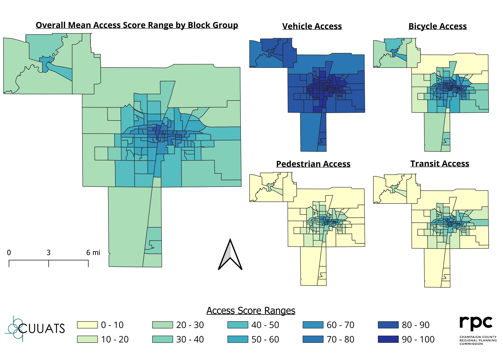

<figcaption>Source: Access Score Tool</figcaption>
</figure>-->

<rpc-table 
url="Overall_Mean_Access_Ranges.csv" 
text-alignment="1,c" 
table-title="Table 2. MPA Average Access Scores" 
switch="false"
source-url="https://www.ccrpc.org/planning/sustainable_neighborhoods_toolkit.php"  
source="CUUATS Access Score Tool"
style="width:50%">

</rpc-table>

## Low Vehicle Access

Most housing units have direct access to the local road network. However, not all households have access to a vehicle for a variety of reasons, including high costs to purchase and maintain a vehicle, lack of a driver’s license, physical inability to drive, or lack of desire to drive or own a vehicle. For households and individuals without access to a vehicle, mobility depends on safe walking, bicycling, and transit infrastructure to participate in the activities for daily life like work, school, social engagements, shopping, physical exercise, etc.

According to the US Census Bureau, 14.3 percent of all households and 7.9 percent of all workers (16 years and over) in the Champaign-Urbana MPA urban areas have no vehicles available to them. Figure 4 shows the 28 Census Block Groups in the MPA where 25 percent or more of the households do not have access to a vehicle. 

Tables 3 and 4 display population data for low vehicle access block groups in the MPA. Results show that  Asian residents, Limited English Proficient residents, Hispanic/Latine residents, male residents, residents identifying as Some Other Race, and households living below the poverty line are overrepresented in block groups with low vehicle access. White and Black or African American residents, as well as Seniors (aged 65 and older), female residents, and households with one or more persons with disabilities are underrepresented in block groups with low vehicle access. This information will be noted in the summaries of the different demographic groups profiled throughout the rest of this section. 

<figure>

<figcaption><b>Figure 11. Block Groups with Low Vehicle Access (Over 25%)</b></figcaption>
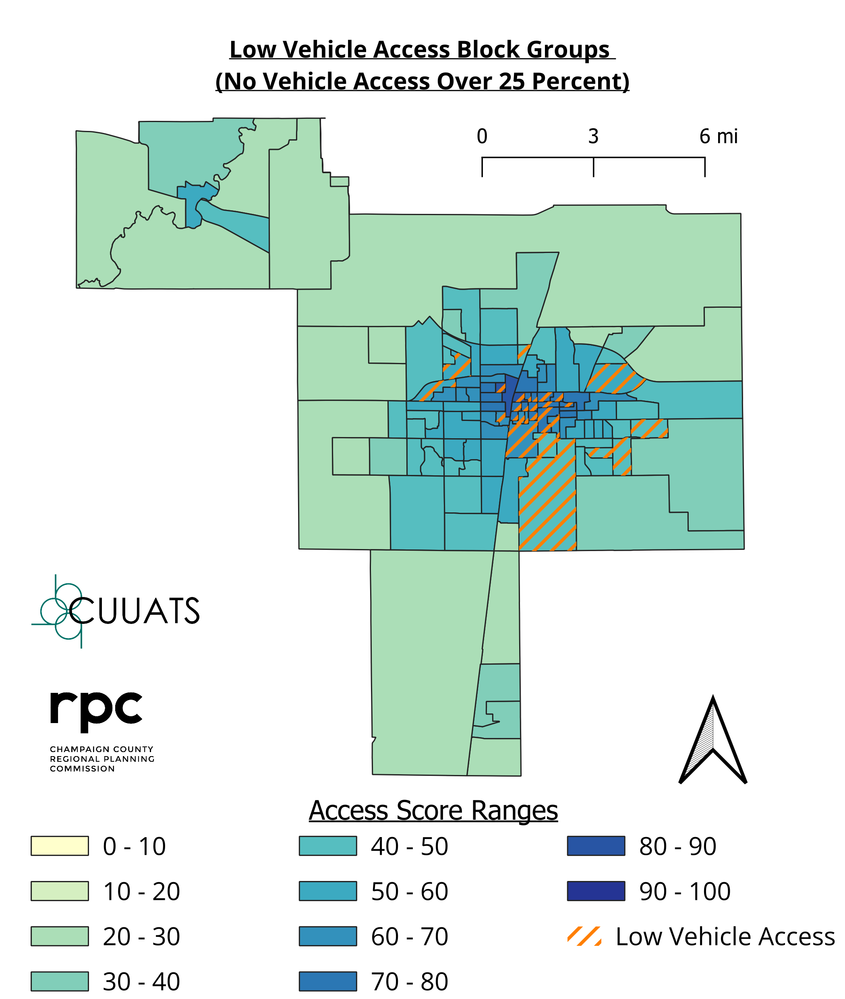

<figcaption><b>Source: Access Score Tool and US Census Bureau Table B22010</b></figcaption>
</figure>

<rpc-table 
url="Table 2 Low Vehicle Access in MPA - Race.csv" 
text-alignment="1,r" 
table-title="Table 3. Low Vehicle Access Title VI Populations - Race" 
switch="false" 
source="US Census Bureau Tables B25044 and B02001"
style="width:80%">

</rpc-table>

<rpc-table 
url="Table 2 Low Vehicle Access in MPA - Other Categories.csv" 
text-alignment="1,r" 
table-title="Table 4. Low Vehicle Access Title VI Populations - Other Categories" 
switch="false" 
source="US Census Bureau Tables B16004, B17021, B22010, B25044, B01001, and B03003"
style="width:80%">

</rpc-table>

# Title VI Transportation Profiles

CUUATS staff identified the block groups with average and above average rates of each Title VI population in the MPA using data from the American Community Survey's 5-year data covering 2018-2022. With this information, staff then calculated the average access scores for each set of block groups corresponding to the different Title VI populations and compared those scores with the average access scores for the overall MPA in order to identify discrepancies. Table 5 displays the average access scores for each set of block groups associated with each Title VI population as well as the combined average for all the block groups in the MPA. 

<rpc-table 
url="Overall_Scores_by_Mode.csv" 
columns="1,2,3,4,5,6"
text-alignment="1,c"  
table-title="Table 5. Average Access Scores by Mode for Each Title VI Population" 
switch="false" 
source="US Census Bureau Tables B16004, B17021, B22010, B25044, B01001, B03003, and B02001"
style="width:100%">

</rpc-table>

Overall, there is not a large amount of variation from the overall MPA average. Ten Title VI populations share the same overall transportation network access score as the MPA. Two Title VI groups have an overall transportation network access score that is one level lower than the MPA score, and two groups have a score that is one level higher. Only block groups with average and above average rates of households living at or below the poverty line and Native Hawaiian and Pacific Islander residents show an above-average score for overall transportation network access compared with the average for all block groups in the MPA. Average and above average block groups for Seniors Aged 65 and Over and Households with Disabilities have overall access score ranges one level below the MPA.</b>

Within the different transportation modes, pedestrian, bicycle, and public transit accessibility had the greatest discrepancies by block group. The majority of residents living at or below the poverty line live in block groups with above average access scores for bicycling, pedestrian, and transit infrastructure. Nearly 44 percent of individuals who live in poverty have low vehicle access (see Table 4), which means this population group is more likely to walk, bike, or take public transit to reach their daily destinations. The highest concentration of residents living in poverty are in the Champaign Urbana urban area, where individuals can more easily travel without owning a personal car.

American Indian and Alaska Native and Native Hawaiian and Pacific Islander block groups also showed higher levels of access for bicycling, pedestrian, and transit modes. It should be noted that these populations make up a very small percentage of the MPA, so these scores, while positive, may be subject to greater fluctuation year over year, statistically.

Men, individuals with Limited English Proficiency, residents of Two or More Races, and Asian residents also share higher access for pedestrian and biking amenities. The highest concentration of block groups with average and above average rates of these populations live in the urbanized area, where residents have considerably higher access to pedestrian, bicycle, and public transit amenities. These populations tend to also live in or near the University district area, a major contributor to alternative transportation modes having greater access for some identified Title VI populations. This trend leads to higher access scores.

Residents identifying as Some Other Race had above average scores for biking only.

Seniors Aged 65 and Over have consistently lower than average accessibility scores for public transit, pedestrian, and vehicle amenities. Households with disabilities also have lower levels of accessibility for public transit amenities compared to the average MPA accessibility score for each transportation mode. This trend could partially be attributed to the higher percentage of rural residents among these aforementioned block groups within the MPA boundaries.

Figures 12-25 provide individual summaries for each Title VI population. Each Title VI population summary includes five maps displaying the five separate access scores for each block group with average and above average rates of residents for that Title VI population according to the American Community Survey 5-year estimates from 2018-2022. Each summary also includes a table summarizing the average access scores for block groups associated with that population alongside the average scores for all the block groups in the MPA, as seen for all Title VI populations and the MPA in Table 3 or Table 4.

## Black or African American

Black or African American residents made up 15.0 percent of the total MPA population in 2022, with 24,222 residents. Black or African American residents live in most regions of the planning area, with the highest concentrations in north Champaign, north Urbana, east Urbana, and west Champaign. Fewer Black or African American residents live in and around the Villages of Mahomet, Tolono, and Bondville.

The maps and access scores presented in this section reflect block groups with average and above average rates of Black or African American residents in the MPA, not all Black or African American residents in the MPA. Table 5 shows all five average access scores for these block groups are the same as the scores for the MPA overall.

Downtown Champaign, areas directly north of West University Avenue, areas north of East Main Street, and sections directly west of South Mattis Avenue in Champaign support the greatest access for bicycling, walking, and public transit.

Block groups with the greatest vehicle access include downtown Champaign, north Champaign, and north Urbana. According to ACS data (Table 3), Black or African American residents are underrepresented in block groups with low vehicle access at 10.6 percent compared with 15.0 percent in the MPA overall.

<figure>

<figcaption><b>Figure 12. Average Access Scores by Race - Black or African American</b></figcaption>
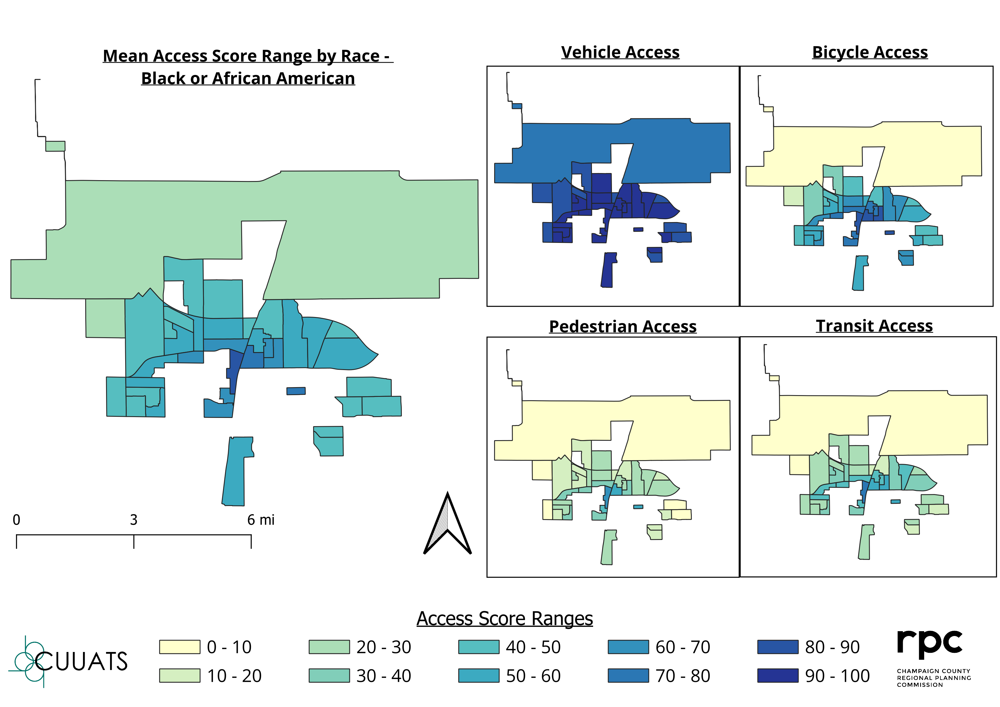

<figcaption><b>Source: Access Score Tool and Census Data Downloader: US Census Bureau Table B02001</b></figcaption>
</figure>

<rpc-table 
url="Mean_Scores_B_AA.csv" 
text-alignment="1,c" 
table-title="Table 5. Average Access Scores for Above Average Black or African American Block Group Populations" 
switch="false"
source="US Census Bureau Table B02001"
source="US Census Table B02001"
style="width:50%">

</rpc-table>

## American Indian and Alaska Native

American Indian and Alaska Native residents made up 0.1 percent of the total MPA population in 2022, with 203 residents. It is important to note that the source for population data, the US Census Bureau’s American Community Survey, lists a high margin of error for this data given the small population size. The maps and access scores presented in this section reflect block groups with average and above average rates of American Indian or Alaska Native residents in the MPA. This includes all American Indian or Alaska Native residents in the MPA as each block group shown has a residential rate higher than the MPA rate. Table 6 shows the overall transportation network access score for these block groups is lower than the score for the MPA overall.

Residents in block groups with average and above average rates of American Indian and Alaska Native residents have an average pedestrian score of 30-39, which is higher than the MPA average of 20-29. This trend is also reflected in the average transit and bicycle scores for these block groups which is 40-49 and 60-69, compared with 30-39 and 50-59 for the MPA, respectively.

Sections of the university district and areas east of South Neil Street in Champaign to Race Street support the greatest levels of accessibility for walking, bicycling, and transit, and American Indian and Alaska Native populations have higher representation in urban core block groups.

Residents in these block groups have an average vehicle score of 90-100, which is the same as the average for the MPA. Block groups with the greatest vehicle access include areas with the greatest access include sections of the university district, areas east of South Neil Street in Champaign to Race Street in Urbana, and the block groups surrounding the intersection of Interstate 74 and North Lincoln Avenue and between East Washington Street and East Main Street.

According to ACS data (Table 3), American Indian and Alaska Native residents are equally represented in block groups with low vehicle access at 0.1 percent compared with 0.1 percent in the MPA overall.

<figure>

<figcaption><b>Figure 13. Average Access Scores by Race - American Indian and Alaska Native</b></figcaption>
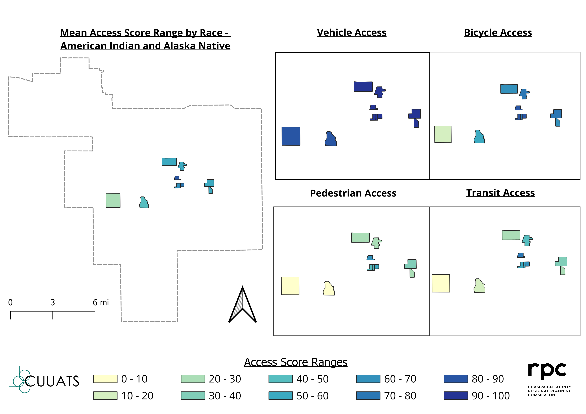

<figcaption><b>Source: Access Score Tool and Census Data Downloader: US Census Bureau Table B02001</b></figcaption>
</figure>

<rpc-table 
url="Mean_Scores_AI_AN.csv" 
text-alignment="1,c" 
table-title="Table 6. Average Access Scores for Above Average American Indian and Alaska Native Block Group Populations" 
switch="false"
source="US Census Bureau Table B02001"
style="width:50%">

</rpc-table>

## Asian

Asian residents made up 13.9 percent of the total MPA population in 2022, with 22,339 residents. Asian residents live in most regions of the planning area, with the highest concentrations in the University District, north/central Champaign and Urbana, along the west and southwest fringe of Champaign, to the east of the university district, and on the eastern edge of Urbana. Fewer Asian residents live in the Villages of Mahomet, Bondville, Tolono, and central Champaign and Urbana.

The maps and access scores presented in this section reflect block groups with average and above average rates of Asian residents in the MPA, not all Asian residents in the MPA. Table 7 shows the overall transportation network access score for these block groups is the same as the score for the MPA overall.

Residents in block groups with average and above average rates of Asian residents have an average pedestrian score of 30-39, which is greater than the MPA average of 20-29. This trend is also reflected in the average bike score for these block groups which is 60-69 compared with 50-59 for the MPA. The average transit score for these block groups matches the average for the MPA at 30-39.

Sections of the university district, areas directly east and west of South Neil Street in Champaign to Race Street in Urbana, and south of Interstate 74 between University Avenue and 1800 E in Urbana support the greatest levels of accessibility for walking, bicycling, and transit.

Residents in these block groups have an average vehicle score of 90-100, which matches the average for the MPA. Block groups with the greatest vehicle access include north Savoy, east central and north Champaign, west central and north Urbana, and the university district. According to ACS data (Table 2), Asian residents are heavily overrepresented in block groups with low vehicle access at 23.5 percent compared with 13.9 percent in the MPA overall.

<figure>

<figcaption><b>Figure 14. Average Access Scores by Race - Asian</b></figcaption>
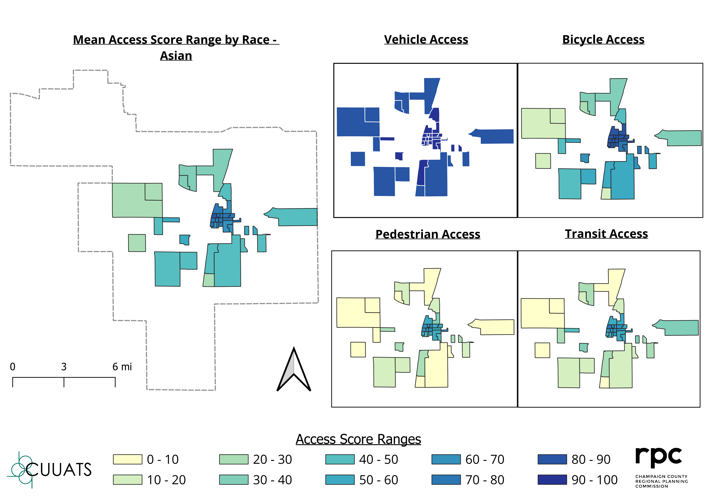

<figcaption><b>Source: Access Score Tool and Census Data Downloader: US Census Bureau Table B02001</b></figcaption>
</figure>

<rpc-table 
url="Mean_Scores_A.csv" 
text-alignment="1,c" 
table-title="Table 7. Average Access Scores for Above Average Asian Block Group Populations" 
switch="false"
source="US Census Bureau Table B02001"
style="width:50%">

</rpc-table>

## Native Hawaiian and Pacific Islander

Hawaiian or Other Pacific Islander residents made up 0.1 percent of the total MPA population in 2022, with 87 residents. The highest concentrations of Hawaiian or Other Pacific Islander residents are located in northeast Mahomet, the University District, and north Champaign.

The maps and access scores presented in this section reflect block groups with average and above average rates of Hawaiian or Other Pacific Islander residents in the MPA. This includes all Native Hawaiian and Pacific Islander residents in the MPA as each block group shown has a residential rate higher than the MPA rate. Table 8 shows the overall transportation network access score for these block groups is the same as the score for the MPA overall.

Residents in block groups with average and above average rates of Hawaiian or Other Pacific Islander residents have a higher than average pedestrian score of 30-39 compared to the MPA average of 20-29. This trend is also reflected in the average transit score for these block groups and the MPA at 40-49 compared to 30-39. Also, the average bicycle score for these block groups is also above the average for the MPA at 60-69 compared to 50-59.

West central Urbana supports the greatest level of accessibility for walking, bicycling, and public transit usage for Hawaiian or Other Pacific Islander residents.

Residents in these block groups have an average vehicle score of 90-100, which is the same as the average for the MPA. All areas with a high concentration of residents of Native Hawaiian and Pacific Islander have high levels of vehicle access. 

According to ACS data (Table 3), Hawaiian or Other Pacific Islander residents are slightly overrepresented in block groups with low vehicle access at 0.1 percent compared with 0.1 percent in the MPA overall.

<figure>

<figcaption><b>Figure 15. Average Access Scores by Race - Native Hawaiian and Pacific Islander</b></figcaption>
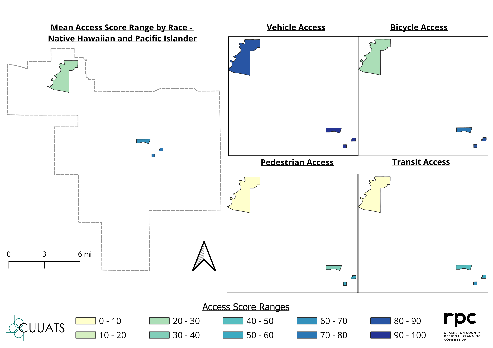

<figcaption><b>Source: Access Score Tool and Census Data Downloader: US Census Bureau Table B02001</b></figcaption>
</figure>

<rpc-table 
url="Mean_Scores_NH_PI.csv" 
text-alignment="1,c" 
table-title="Table 8. Average Access Scores for Above Average Native Hawaiian and Pacific Islander Block Group Populations" 
switch="false"
source="US Census Bureau Table B02001"
style="width:50%">

</rpc-table>

## White

White residents made up 63.7 percent of the total MPA population in 2022, with 108,927 residents. White residents live in all regions of the MPA with the lowest concentrations north of the University of Illinois, the western fringe of Champaign and the eastern fringe of Urbana.

The maps and access scores presented in this section reflect block groups with average and above average rates of White residents in the MPA, not all White residents in the MPA. Table 9 shows the overall transportation network access score and the access score for each mode for these block groups is the same as the MPA overall.

The mean exact scores for each mode are slightly below the average for the region, but they are in the same range as the averages. This suggests that the white populations considerably contribute to the average scores as white populations are the general majority of the MPA at approximately a 2:1 ratio.

Central Mahomet, sections directly east and west of South Neil Street, south of the university district areas, north Savoy, and southwest Champaign support the greatest level of accessibility for walking, bicycling, and public transit usage. Block groups with the greatest vehicle access include north Savoy, east central and north Champaign, west and central Urbana, and the university district. 

According to ACS data (Table 3), White residents are heavily underrepresented in block groups with low vehicle access at 57.3 percent compared with 63.7 percent in the MPA overall.

<figure>

<figcaption><b>Figure 16. Average Access Scores by Race - White</b></figcaption>
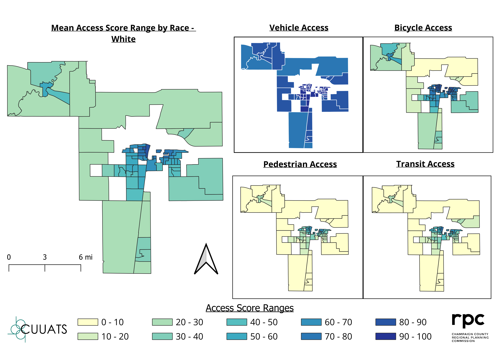

<figcaption><b>Source: Access Score Tool and Census Data Downloader: US Census Bureau Table B02001</b></figcaption>
</figure>

<rpc-table 
url="Mean_Scores_W.csv" 
text-alignment="1,c" 
table-title="Table 9. Average Access Scores for Above Average White Block Group Populations" 
switch="false"
source="US Census Bureau Table B02001"
style="width:50%">

</rpc-table>

## Other Race

Residents of some other race made up 1.8 percent of the total MPA population in 2022, with 2,915 residents. Residents of other races live in many regions of the planning area with the highest concentrations inside the Champaign-Urbana urban area. The highest concentrations of residents of other races are located in central, east, and southwest Champaign; west, east, and south Urbana, and northwest Savoy.

The maps and access scores presented in this section reflect block groups with average and above average rates of residents of some other race in the MPA, not all residents of some other race in the MPA. Table 10 shows the overall transportation network access score for these block groups is the same as the score for the MPA overall.

Residents in block groups with average and above average rates of residents of some other race have all scores within the same range as the MPA overall Central Champaign, east Champaign, and west Urbana support the greatest level of accessibility for walking, bicycling, and public transit usage. 

It should be noted that since the previous Title VI document, the Census has updated its methodology for counting those in the "Some Other Race" and "Two or More Races" categories. As a result, the Other Race population appears to have doubled since 2017, but this result is likely heavily influenced by this change. This will also have an effect on general areas of increased representation in the urban areas, which CUUATS will continue to consider when conducting its public outreach.

According to ACS data (Table 3), White residents are slightly overrepresented in block groups with low vehicle access at 2.0 percent compared with 1.8 percent in the MPA overall.

<figure>

<figcaption><b>Figure 17. Average Access Scores by Race - Other Race</b></figcaption>
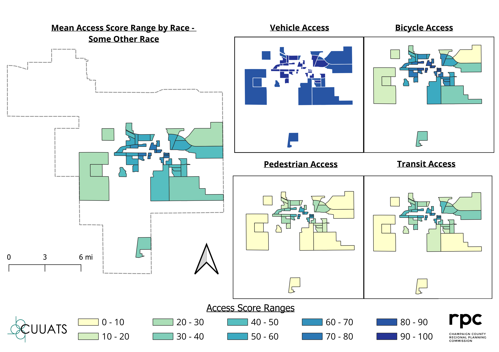

<figcaption><b>Source: Access Score Tool and Census Data Downloader: US Census Bureau Table B02001</b></figcaption>
</figure>

<rpc-table 
url="Mean_Scores_SOR.csv" 
text-alignment="1,c" 
table-title="Table 10. Average Access Scores for Above Average Other Race Block Group Populations" 
switch="false"
source="US Census Bureau Table B02001"
style="width:50%">

</rpc-table>

## Two Or More Races

Residents of two or more races made up 5.4 percent of the total MPA population in 2022, with 8,843 residents. Residents of two or more races live in most regions of the planning area with the highest concentrations in the Cities of Champaign and Urbana, and in north and south Mahomet.

The maps and access scores presented in this section reflect block groups with average and above average rates of residents of two or more races in the MPA, not all residents of two or more races in the MPA. Table 11 shows all five average access scores for these block groups are the same as the scores for the MPA overall.

Central Champaign, central Urbana, east Champaign, and west Urbana support the greatest level of accessibility for walking, bicycling, and public transit usage.

Areas with an average or above average concentration of residents of two or more races have a higher than average range level of bicycle and pedestrian access, 60-69 and 30-39, respectively. Transit and vehicle access are in line with the MPA average.

According to ACS data (Table 3), residents of two or more races are very slightly overrepresented in block groups with low vehicle access at 5.4 percent compared with 5.4 percent in the MPA overall.

It should be noted that since the previous Title VI document, the Census has updated its methodology for counting those in the "Some Other Race" and "Two or More Races" categories. As a result, the Other Race population appears to have doubled since 2017, but this result is likely heavily influenced by this change. This will also have an effect on general areas of increased representation in the urban areas, which CUUATS will continue to consider when conducting its public outreach.

<figure>

<figcaption><b>Figure 18. Average Access Scores by Race - Two or More Races</b></figcaption>
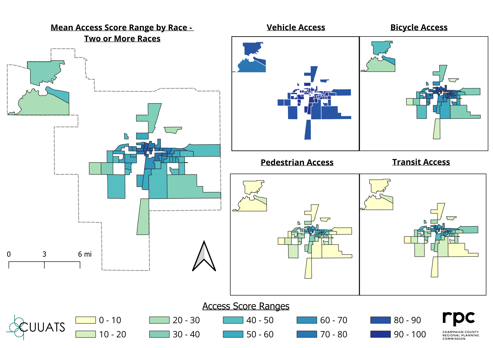

<figcaption><b>Source: Access Score Tool and Census Data Downloader: US Census Bureau Table B02001</b></figcaption>
</figure>

<rpc-table 
url="Mean_Scores_TR.csv" 
text-alignment="1,c" 
table-title="Table 11. Average Access Scores for Above Average Two or More Races Block Group Populations" 
switch="false"
source="US Census Bureau Table B02001"
style="width:50%">

</rpc-table>

## Hispanic or Latine

Hispanic or Latine residents made up 6.7 percent of the total MPA in 2022, with a population of 10,838. Hispanic or Latine residents live in the highest concentrations in south Mahomet, the University District, north and southwest Champaign, and the fringe block groups of Urbana.

The maps and access scores presented in this section reflect block groups with average and above average rates of Hispanic or Latino/a residents in the MPA, not all Hispanic or Latino/a residents in the MPA. Table 12 shows all five average access scores for these block groups are the same as the scores for the MPA overall.

All areas with an average to high concentration of Hispanic or Latine residents have equal ranges of access for each mode when compared to the MPA.

East Champaign and west Urbana near the university district area support the greatest level of accessibility for walking, bicycling, and public transit usage for Hispanic or Latino/a residents.

According to ACS data (Table 4), Hispanic or Latino/a residents are overrepresented in block groups with low vehicle access at 8.3 percent compared with 6.7 percent in the MPA overall.

<figure>

<figcaption><b>Figure 19. Average Access Scores by Hispanic/Latine Origin</b></figcaption>
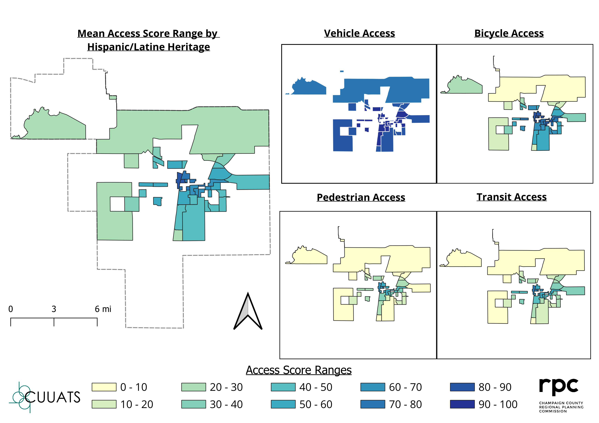

<figcaption><b>Source: Access Score Tool and Census Data Downloader: US Census Bureau Table B03003</b></figcaption>
</figure>

<rpc-table 
url="Mean_Scores_H_L.csv" 
text-alignment="1,c" 
table-title="Table 12. Average Access Scores for Above Average Hispanic/Latine Block Group Populations" 
switch="false"
source="US Census Bureau Table B03003"
style="width:50%">

</rpc-table>

## Seniors Aged Sixty-five Years and Above (65+) 

Seniors made up 12.4 percent of the total MPA population in 2022, with 20,999 residents. The highest concentrations of seniors live in central Urbana and southwest Champaign.

The maps and access scores presented in this section reflect block groups with average and above average rates of senior residents in the MPA, not all senior residents in the MPA. Table 13 shows the overall transportation network access score for these block groups is lower than the score for the MPA overall.

Residents in block groups with average and above average rates of seniors  have an average pedestrian score of 10-19, which is lower than the MPA average of 20-29. This trend is also reflected in the average transit score for these block groups which is 20-29 compared with 30-39 for the MPA. The average bicycle score for these block groups is in the same accessibility range as the MPA at 50-59.

Central Urbana and southwest Champaign support the greatest level of accessibility for walking, bicycling, and public transit usage for seniors.
Residents in these block groups have an average vehicle score of 80-89, which is lower than the average for the MPA, which is 90-100. The score is barely under the vehicle score for the MPA, but does fall within the lower range.

Overall access for senior populations was in the 40-49 range while the rest of the MPA scored 50-59.

According to ACS data (Table 4), senior residents are heavily underrepresented in block groups with low vehicle access at 3.7 percent compared with 12.4 percent in the MPA overall.

<figure>

<figcaption><b>Figure 20. Average Access Scores by Age - Sixty-five Years and Above (65+)</b></figcaption>
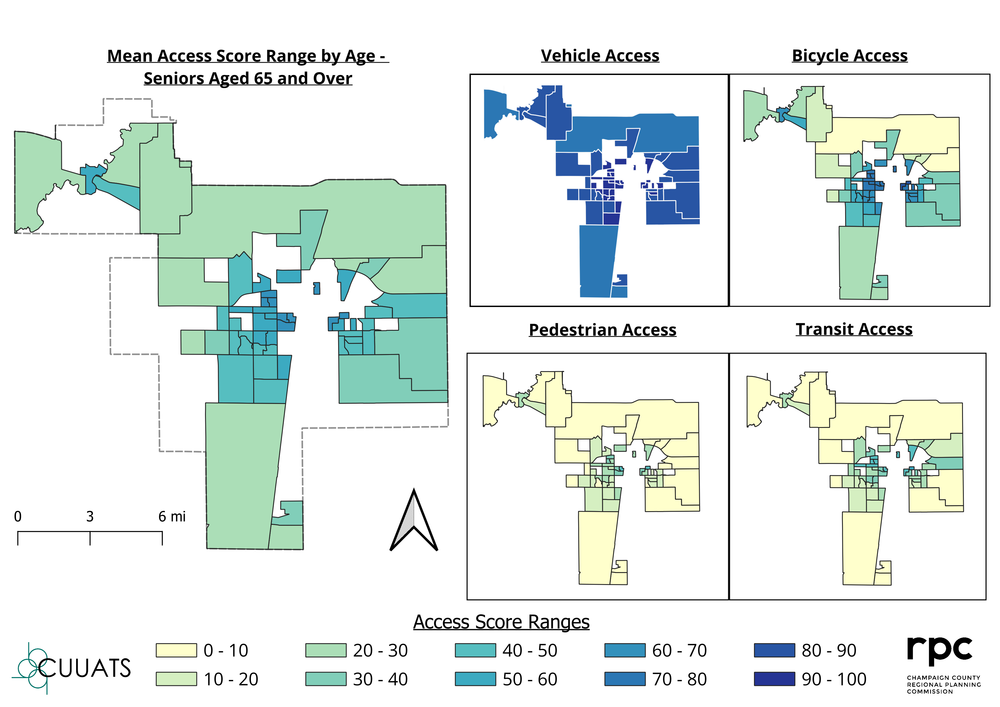

<figcaption><b>Source: Access Score Tool and Census Data Downloader: US Census Bureau Table B01001</b></figcaption>
</figure>

<rpc-table 
url="Mean_Scores_Sen.csv" 
text-alignment="1,c" 
table-title="Table 13. Average Access Scores for Above Average Senior (65+) Block Group Populations" 
switch="false"
source="US Census Bureau Table B01001"
style="width:50%">

</rpc-table>

## Household Poverty

Roughly a quarter of the total MPA population, or 31,955 residents, was living at or below the poverty line in 2022. Residents living at or below the poverty line live in many regions of the planning area, with the highest concentrations in the university district areas in Urbana and Champaign, as well as directly north and central Champaign, and the eastern edge of Urbana.

The maps and access scores presented in this section reflect block groups with average and above average rates of residents living at or below the poverty line in the MPA, not all residents living at or below the poverty line in the MPA. Table 14 shows the overall transportation network access score for these block groups is higher than the score for the MPA overall.

Residents in block groups with average and above average rates of residents living at or below the poverty line have an average pedestrian score of 40-49, which is higher than the MPA average of 20-29. This trend is also reflected in the average transit score for these block groups which is 40-49 compared with 30-39 for the MPA. The average bicycle score is also higher for this block group at 70-79, compared to the MPA average at 50-59.

University district areas in Urbana and Champaign support the greatest level of accessibility for walking, bicycling, and public transit usage for residents living at or below the poverty line. The effects of University infrastructure catered toward active transportation modes provide a tremendous benefit for those that live in the area for transportation. Students and staff are also allowed to ride the bus for free as student fees support this option.

Residents in these block groups have an average vehicle score of 90-100, which matches the average for the MPA. All areas with a high concentration of residents living at or below the poverty line have high levels of vehicle access. However, the University supports lower vehicle ownership on campus as alternative modes can provide similar or reduced travel times when compared to vehicles.

According to ACS data (Table 4), individuals living at or below the poverty line are significantly overrepresented in block groups with low vehicle access (43.6 percent compared to 21.5 percent in the MPA overall).

<figure>

<figcaption><b>Figure 21. Average Access Scores by Household Poverty Status</b></figcaption>
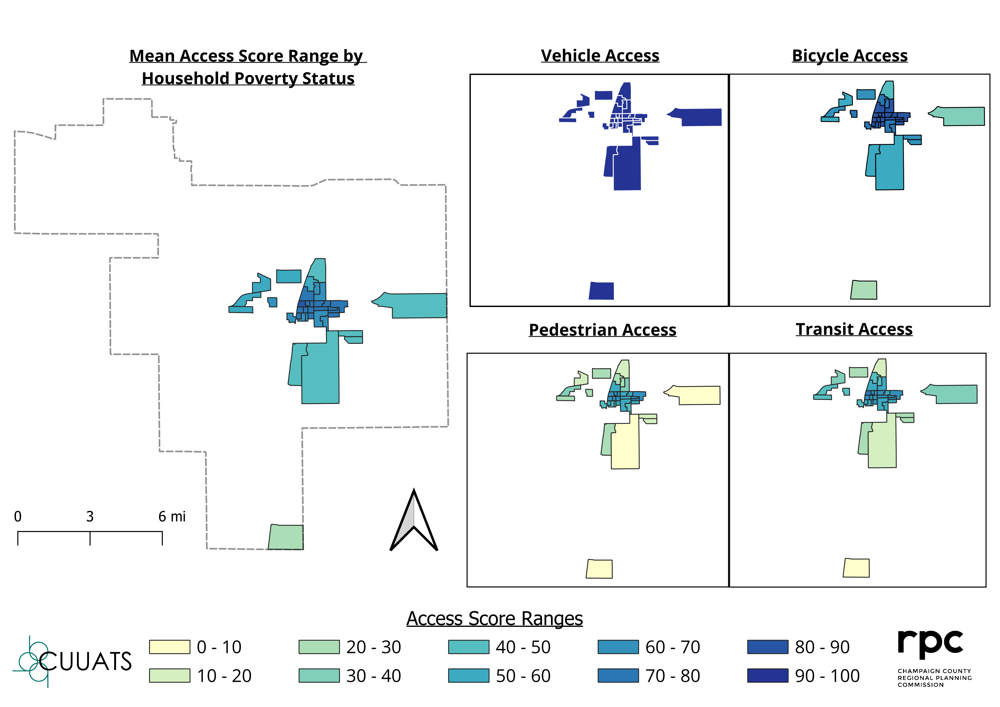

<figcaption><b>Source: Access Score Tool and Census Data Downloader: US Census Bureau Table B17021</b></figcaption>
</figure>

<rpc-table 
url="Mean_Scores_Pov.csv" 
text-alignment="1,c" 
table-title="Table 14. Average Access Scores for Above Average Household Poverty Status Block Groups" 
switch="false"
source="US Census Bureau Table B17021"
style="width:50%">

</rpc-table>

## Household Disability

Households with one or more persons with a disability made up 18.4 percent of the total MPA population in 2022, with 12,279 households. The highest concentrations of these households are east Champaign, central Champaign, central Urbana, and central Mahomet.

The maps and access scores presented in this section reflect block groups with average and above average rates of households with disabilities in the MPA, not all households with disabilities in the MPA. Table 15 shows the overall transportation network access score for these block groups is lower than the score for the MPA overall.

Residents in block groups with average and above average rates of households with disabilities have an average pedestrian score of 10-19, which is lower than the MPA average of 20-29. This trend is also reflected in the average transit score for these block groups which is 20-29 compared with 30-39 for the MPA. The average bicycle score for these block groups is also lower than the average at 40-49 compared to the MPA average of 50-59.

East Champaign, central Champaign, central Urbana, and central Mahomet support the greatest level of accessibility for walking, bicycling, and public transit usage for households with disabilities. The lower accessibility scores may be attributed to the more rural residence location of households with one or more persons with a disability throughout the MPA.

Residents in these block groups have an average vehicle score of 90-100, which matches the average for the MPA. All areas with a high concentration of households with disabilities have high levels of vehicle access.

According to ACS data (Table 4), households with disabilities are underrepresented in block groups with low vehicle access: 13.5 percent compared to 18.4 percent in the MPA overall.

<figure>

<figcaption><b>Figure 22. Average Access Scores by Household Disability Status</b></figcaption>
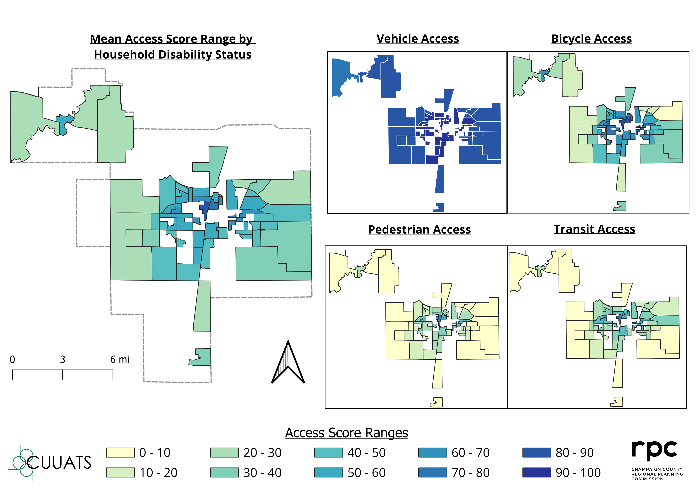

<figcaption><b>Source: Access Score Tool and Census Data Downloader: US Census Bureau Table B22010</b></figcaption>
</figure>

<rpc-table 
url="Mean_Scores_Disab.csv" 
text-alignment="1,c" 
table-title="Table 15. Average Access Scores for Above Average Household Disability Status Block Groups" 
switch="false"
source="US Census Bureau Table B22010"
style="width:50%">

</rpc-table>

## Male

Male residents made up 50.2 percent of the total MPA in 2022, with a population of 83,920.

The maps and access scores presented in this section reflect block groups with average and above average rates of male residents in the MPA, not all male residents in the MPA. The broad dispersion of both females and males in the community could make the spatial differences appear more significant on maps and in text than residents experience them. Table 16 shows the overall transportation network access score for these block groups is the same as the score for the MPA overall.

Residents in block groups with average and above average rates of male residents have an average pedestrian score of 30-39, which is greater than the MPA average of 20-29. This trend is also reflected in the average transit score for these block groups which is 40-49 compared with 30-39 for the MPA. The average bicycle score for these block groups is higher than the average at 60-69, compared to 50-59 for the MPA.

The Cities of Champaign and Urbana support the greatest level of accessibility for walking, bicycling, and public transit usage for male residents.

Residents in these block groups have an average vehicle score of 90-100, which matches the average for the MPA. All areas with a high concentration of male residents have high levels of vehicle access.

According to ACS data (Table 4), male residents are overrepresented in block groups with low vehicle access (56.5 percent versus 50.2 percent of the total MPA population).

<figure>

<figcaption><b>Figure 23. Average Access Scores by Sex - Male </b></figcaption>
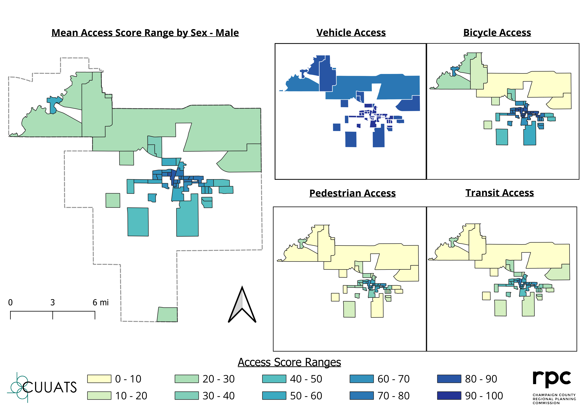

<figcaption><b>Source: Access Score Tool and Census Data Downloader: US Census Bureau Table B01001</b></figcaption>
</figure>

<rpc-table 
url="Mean_Scores_Male.csv" 
text-alignment="1,c" 
table-title="Table 16. Average Access Scores for Above Average Male Block Group Populations" 
switch="false"
source="US Census Bureau Table B01001"
style="width:50%">

</rpc-table>

## Female

Female residents made up 49.8 percent of the total MPA in 2022, with a population of 83,616.

The maps and access scores presented in this section reflect block groups with average and above average rates of female residents in the MPA, not all female residents in the MPA. The broad dispersion of both females and males in the community could make the spatial differences appear more significant on maps and in text than residents experience them. Table 17 shows the overall transportation network access score for these block groups is lower than the score for the MPA overall.

Residents in block groups with average and above average rates of female residents have an average pedestrian score of 20-29, which is equal to the MPA average of 20-29. The average transit score for this block group is 20-29, lower than the MPA at 30-39. The average bicycle score for these block groups is also lower than average at 40-49, compared to 50-59 for the MPA.

The Cities of Champaign and Urbana support the greatest level of accessibility for walking, bicycling, and public transit usage for female residents.

Residents in these block groups have an average vehicle score of 90-100, which matches the average for the MPA. All areas with a high concentration of female residents have high levels of vehicle access.

According to ACS data (Table 4), female residents are slightly underrepresented in block groups with low vehicle access (48.8 percent versus 49.8 percent of the total MPA population).

<figure>

<figcaption><b>Figure 24. Average Access Scores by Sex - Female </b></figcaption>
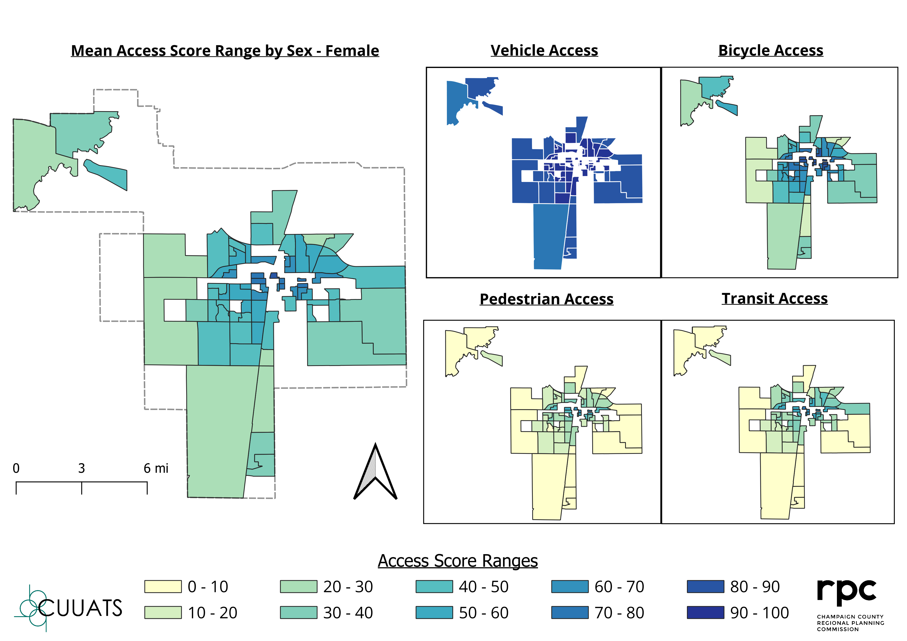

<figcaption><b>Source: Access Score Tool and Census Data Downloader: US Census Bureau Table B01001</b></figcaption>
</figure>

<rpc-table 
url="Mean_Scores_Fem.csv" 
text-alignment="1,c" 
table-title="Table 17. Average Access Scores for Above Average Female Block Group Populations" 
switch="false"
source="US Census Bureau Table B01001"
style="width:50%">

</rpc-table>

## Limited English Proficiency (LEP)

Residents with Limited English proficiency (LEP) made up eight percent of the total MPA population (5 years of age and over) in 2022, with 10,771 residents.

The maps and access scores presented in this section reflect block groups with average and above average rates of LEP residents in the MPA, not all LEP residents in the MPA. Table 18 shows the overall transportation network access score for these block groups is the same as the score for the MPA overall.

Residents in block groups with average and above average rates of LEP residents have an average pedestrian score of 30-39, which is higher than the MPA average of 20-29. The bicycle score for LEP block groups is also slight above the average in the 60-69 range, compared to 50-59 for the MPA. The average transit and vehicle scores for these block groups are the same as the average scores for the MPA.

East Champaign and west Urbana support the greatest level of accessibility for walking, bicycling, and public transit usage for LEP residents.

According to ACS data (Table 4), LEP residents are overrepresented in block groups with low vehicle access (11.7 percent compared to 7.3 percent in the MPA overall).

<figure>

<figcaption><b>Figure 25. Average Access Scores by Limited English Proficiency </b></figcaption>
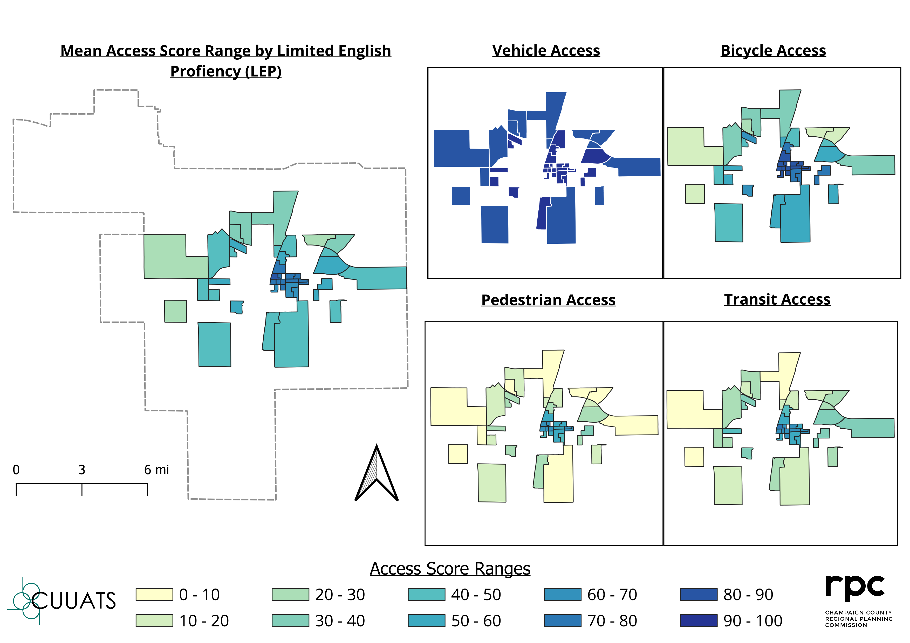

<figcaption><b>Source: Access Score Tool and Census Data Downloader: US Census Bureau Table B16004</b></figcaption>
</figure>

<rpc-table 
url="Mean_Scores_LEP.csv" 
text-alignment="1,c" 
table-title="Table 18. Average Access Scores for Above Average Limited English Proficiency (LEP) Block Group Populations" 
switch="false"
source="US Census Bureau Table B16004"
style="width:50%">

</rpc-table>

## Federally-Recognized Disadvantaged Areas

The USDOT provides equity and Justice40 analysis tools, one of which is recommended for Justice40 funding programs called the Climate and Economic Justice Screening Tool (CEJST). Additionally, the DOT provides another tool that addresses disadvantages in transportation called the Equitable Transportation Community (ETC) Explorer. The map figure in the Introduction provides a breakdown of these areas identified by one or both of these tools.

This subsection provides analysis for the combined groups' access scores and specifically for the CEJST-defined areas. CEJST areas were isolated because of their distance from the urban core, which would have an effect on their overall access scores. DOT disadvantaged areas were not isolated because many of these areas are in the urban core and can be assumed by the combined analysis to have higher average scores.

### Combined

Residents in the combined CEJST and DOT Disadvantaged areas made up 31 percent of the total MPA population in 2022, with 49,761 residents.

Table 19 shows the overall transportation network access score for these block groups is the same as the score for the MPA overall. Average access scores were one level above the MPA averages for pedestrian, bicycle, and transit scores. Vehicle access was the same as the regional area.

East Champaign and west Urbana support the greatest level of accessibility for walking, bicycling, and public transit usage for LEP residents, which encompasses the southern-most portion of these disadvantaged areas.

Low vehicle access may significantly affect the southern portion of this area, though portions of it are within the University District.

<figure>

<figcaption><b>Figure 26. Average Access Scores by Combined CEJST and DOT Disadvantaged Areas</b></figcaption>
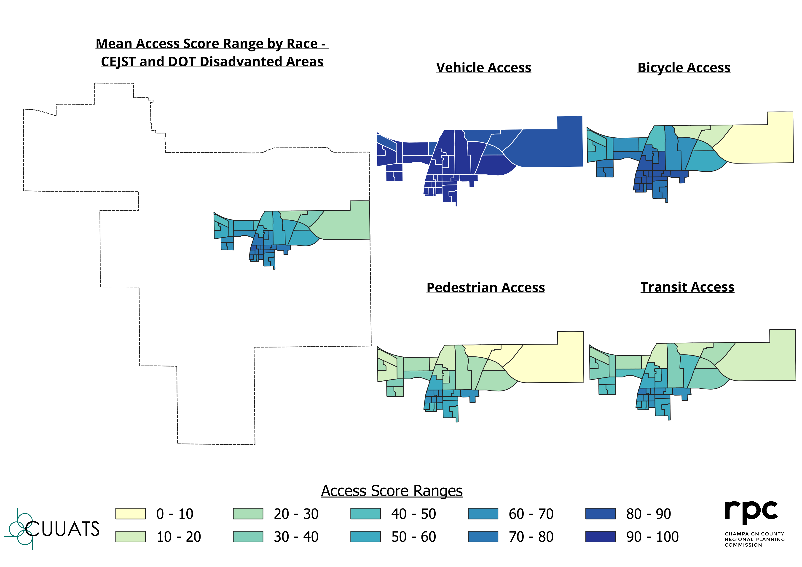

<figcaption><b>Source: Access Score Tool and ETC Explorer Tool</b></figcaption>
</figure>

<rpc-table 
url="Mean_Scores_Comb_Disad.csv" 
text-alignment="1,c" 
table-title="Table 19. Average Access Scores for Combined CEJST and DOT Disadvantaged Area Populations" 
switch="false"
source="USDOT Equitable Transportation Community (ETC) Explorer"
source-url="https://experience.arcgis.com/experience/0920984aa80a4362b8778d779b090723/page/ETC-Explorer--Add-Your-Data-(National-and-State-Results)/"
style="width:50%">

</rpc-table>

### CEJST Areas Alone

Residents in the CEJST areas made up 11.7 percent of the total MPA population in 2022, with 18,709 residents.

Table 20 shows the overall transportation network access score for these block groups is the same as the score for the MPA overall. Average access score ranges were the same as the MPA averages for pedestrian, bicycle, transit, and vehicle scores. However, the overall score was one step below the regional average. The overall score being lower was dependent on the bicycle and pedestrian scores being lower than the area average, though the scores were within the same range as the subgroup for each mode.

These areas are the north side of both Champaign and Urbana, and they are far enough from the urban core to contribute to lower bicycle and pedestrian scores. Transit access is summarily average for the region, and vehicle access is excellent.

Low vehicle access may significantly affect 3 of these tracts and may require greater reliance on transit service due to lower scores for bicycle and pedestrian averages.

<figure>

<figcaption><b>Figure 27. Average Access Scores by CEJST Disadvantaged Areas Alone</b></figcaption>
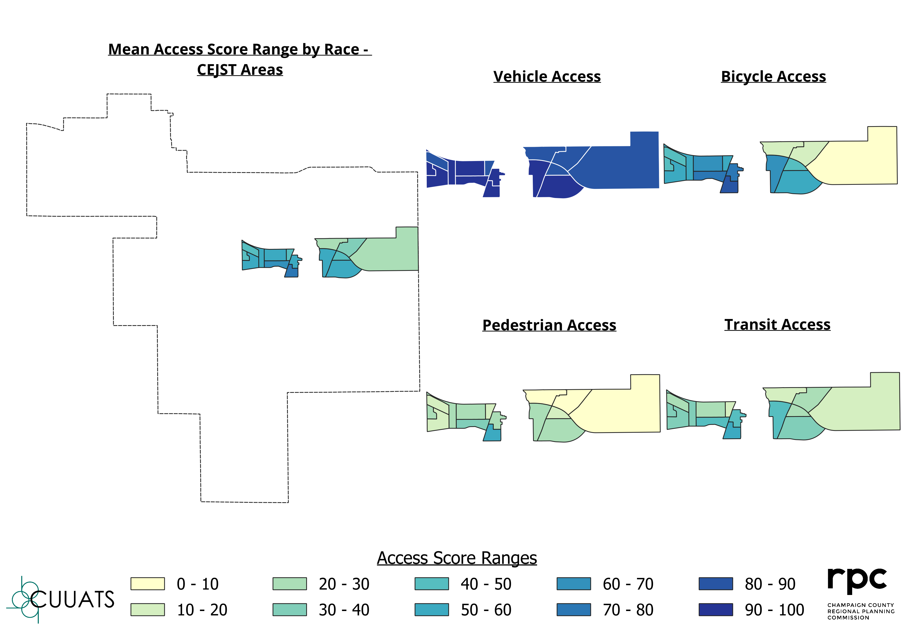

<figcaption><b>Source: Access Score Tool and ETC Explorer Tool</b></figcaption>
</figure>

<rpc-table 
url="Mean_Scores_CEJST.csv" 
text-alignment="1,c" 
table-title="Table 18. Average Access Scores for CEJST Area Populations" 
switch="false"
source="USDOT Equitable Transportation Community (ETC) Explorer"
source-url="https://experience.arcgis.com/experience/0920984aa80a4362b8778d779b090723/page/ETC-Explorer--Add-Your-Data-(National-and-State-Results)/"
style="width:50%">

</rpc-table>